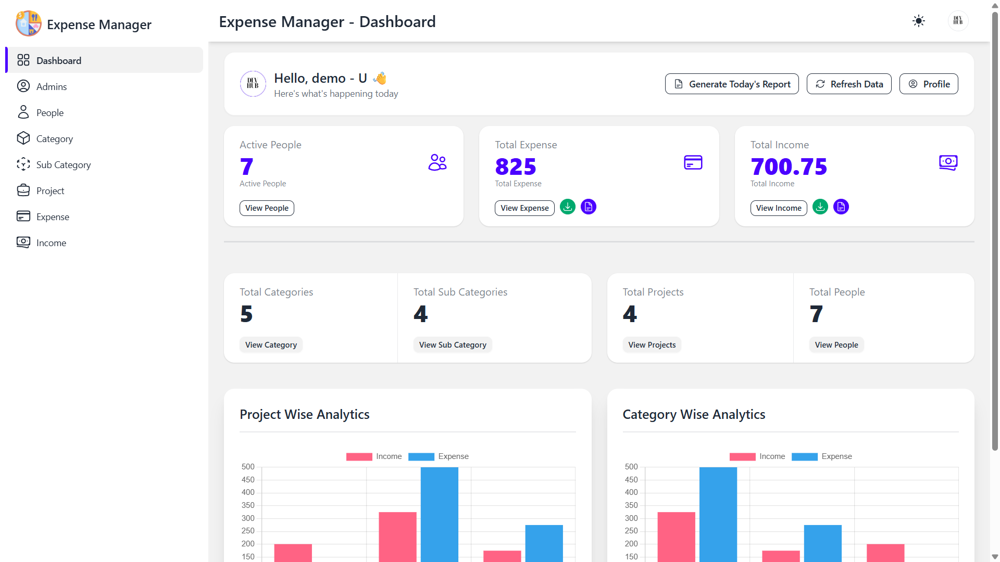

# 💰 Expense-Manager Client

A **React-based Expense Manager** designed for organizations to efficiently manage **people, projects, expenses, and incomes** — with clean UI, real-time reports, and analytics.

---

## 🚀 Live Preview

👉 [https://expense-manager-harpalll.vercel.app/](https://expense-manager-harpalll.vercel.app/)

---

## 🖼️ App Screenshot



---

## 🌟 Overview

**Expense Manager** helps organizations maintain financial transparency and efficiency through a modern and user-friendly interface.

Built with **React**, this app offers a complete solution to handle:

- People & Team Management
- Project & Category Tracking
- Expense & Income Monitoring
- Report Generation (PDF Export)
- Analytics and Visualization
- Email Support Integration

---

## ✨ Key Features

✅ **People Management** — Manage team members and their expense roles.  
✅ **Project Management** — Track projects, their incomes, and expenditures.  
✅ **Expense / Income Management** — Record and categorize transactions easily.  
✅ **User-friendly Interface** — Minimal, responsive, and intuitive UI.  
✅ **Reports and Analytics** — Generate daily, weekly, and custom reports in PDF.  
✅ **Email Support** — Send and receive automated notifications.

---

## 🧠 Tech Stack

- **Frontend:** React, Tailwind CSS, DaisyUI
- **State Management:** React Redux
- **HTTP Client:** Axios
- **Notifications:** React Toastify
- **Deployment:** Vercel

---

## 📦 Installation & Setup

```bash
# Clone the repository
git clone https://github.com/harpalll/expense-manager.git

# Navigate into the project directory
cd expense-manager

# Install dependencies
npm install

# Run the development server
npm start

```

## The app will be available at :

👉 [http://localhost:3000](http://localhost:3000)

## Made with ❤️ by [Harpalsinh Sindhav](https://github.com/harpalll)
